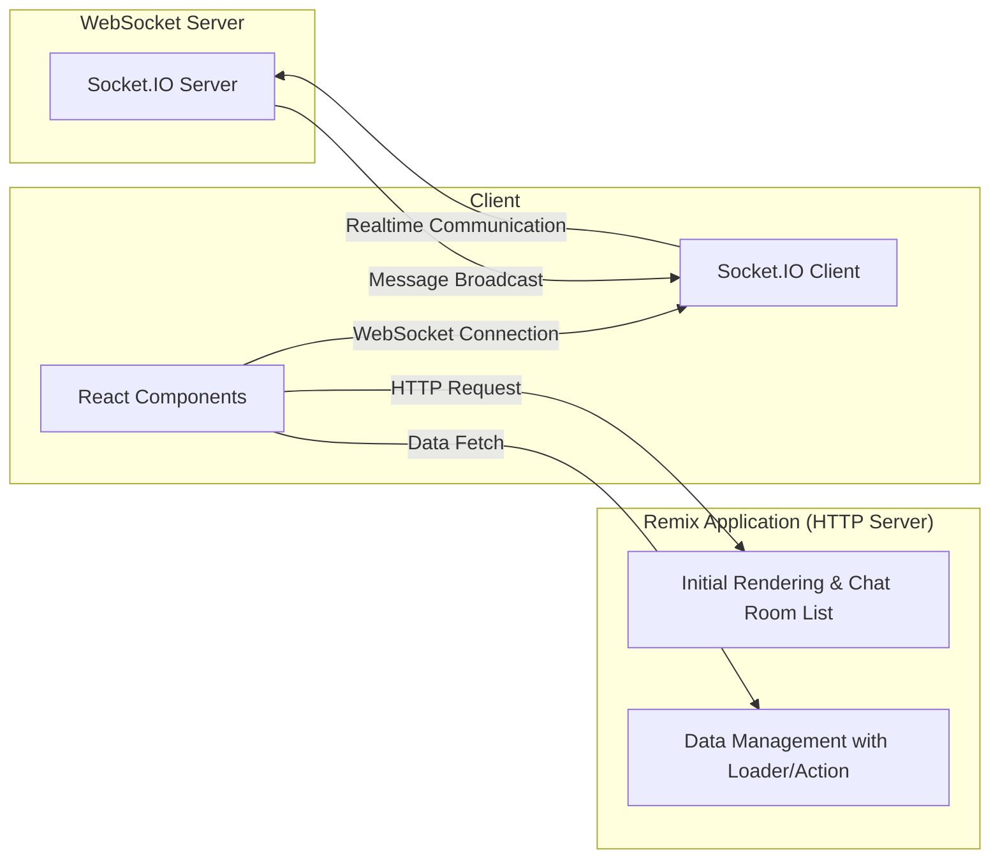

# Realmix Chat 企画書（認証不要版）

## 1. プロジェクト概要

**プロジェクト名**: Realmix Chat  
**概要**:  
Remixを活用したリアルタイムチャットアプリ。ローカルでの簡単な動作確認を目的とし、認証機能を省略して各ブラウザウィンドウごとに独立したチャット参加が可能な仕様とする。  
**目的**:  

- Remixのフルスタック開発手法を実践的に学ぶ  
- HTTP通信とWebSocketを組み合わせたリアルタイムなチャット機能の実装  
- 認証不要により、参加者がすぐにチャット機能を体験できる環境を提供

## 2. 技術スタックと特徴

- **Remix**: サーバーサイドとクライアントサイドのコードを統合管理し、迅速な開発を実現
- **WebSocket/Socket.IO**: リアルタイム通信機能の実装
- **TypeScript**: 静的型付けによるコード品質の向上
- **Node.js**: サーバーサイド実装の基盤
- **データベース**: 将来的なメッセージ履歴の保存などに対応（ローカルデモでは簡易なメモリ管理でも可）

## 3. アーキテクチャ概要

本プロジェクトは、RemixをHTTPサーバーとして利用し、認証機能は省略します。各ブラウザウィンドウやタブが、URLパラメータや自動生成されたユーザーIDを用いて独立してチャットに参加できるシンプルな仕様です。  
リアルタイム通信は、Socket.IOを利用して実現します。

## 4. 主な機能

- **チャット画面の実装**
  - メッセージ一覧の表示と送信フォーム
  - 認証不要のため、各ブラウザが自動的にユーザーIDを生成して利用
- **リアルタイム通信**
  - Socket.IOを利用して、メッセージの即時送受信を実現
- **チャットルーム管理**
  - 認証不要でシンプルに、全ユーザーが同一ルームに参加（将来的にはルーム分割も検討）
- **簡易デモモード**
  - ローカル環境での動作確認を容易にするため、認証をバイパスし、すぐにチャットに参加可能

## 5. 開発フロー

1. **初期実装**
   - Remixを利用して、チャット画面のUI（メッセージ一覧、入力フォーム）を構築
   - 認証機能を除外し、各ブラウザでの自動ユーザーID生成を実装
2. **リアルタイム通信の追加**
   - Socket.IOクライアントを導入し、WebSocket接続を確立
   - サーバー側でSocket.IOハンドラーを実装し、メッセージのリアルタイムブロードキャストを実現
3. **動作確認とフィードバック**
   - ローカル環境で動作を確認（Dockerなどを利用した環境構築も推奨）
   - 複数ブラウザウィンドウでチャットの動作をテストし、リアルタイム性を確認
4. **将来的な拡張**
   - 認証機能の追加（本番環境向け）
   - チャットルームの分割、プライベートチャットなどの機能拡張

## 6. ローカル環境の構築

ローカルで簡単に動作確認できるよう、Dockerを利用した開発環境の構築も推奨します。  
※ 詳細なDockerfileやdocker-composeの設定は、プロジェクトセットアップ時に別途管理します。

## 7. まとめ

**Realmix Chat（認証不要版）**は、認証機能を省略することで、ローカル環境での迅速な動作確認とハンズオン参加者への簡単な体験を提供します。  
このシンプルな仕様をベースに、後日認証やその他の機能拡張を追加することで、実務に近い開発プロセスを段階的に学んでいきます。

---
**ファイル名**: `REALMIX_CHAT_PROPOSAL.md`
